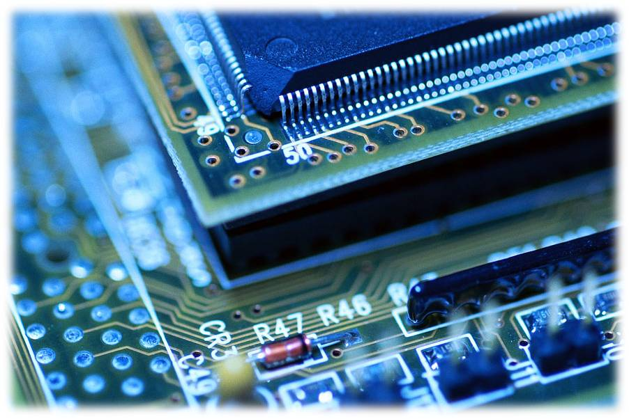

We live in a modern world of computers. There are computers in our homes, our hands, our cars, and even our traffic lights. It’s difficult to go out into the public and avoid the influence of computers because we’re practically surrounded by them. As a result, computers have always been a part of my life.  Even though I have rarely spent a minute without direct contact with any computers, it took me a while to figure out exactly what they are. Computers are physical and theoretical computational systems or machines that contribute to our modern-day culture and society.

<h2>Physical Computer Systems</h2>
Computers are often physical machines or devices that users can sometimes interact with to provide input and receive output. Computers can come in a lot of different physical forms and sizes. The most common type of computer that most people would recognize are desktops and laptops that have a lot of computational power for a very wide variety of applications and services. Smartphones and tablets are also common electronic devices that constitute as computer systems that can fit in the palm of our hands. Embedded computer systems such as those that could be found in cars, microwaves ovens, TV remotes, and traffic lights come in unusual form factors that aren’t often recognized by users. Computers can take on many different forms and sizes, but the level at which they interact with users could also vary. Personal computers can have many forms of interfacing with users through peripherals such as keyboards, mice, monitors, and audio devices. Since PCs support many different applications, there are many different forms of user interfaces. Some computers such as embedded systems are designed primarily to operate without user intervention. These systems often interface with the users minimally through simple buttons and indicator lights. Some computers, such as those used in networks, don’t necessarily interact with users; instead, they interact with other devices to communicate data and establish the backbone of the internet. Whether they interact with users or different devices, all computers have the common purpose of taking input and producing output. Multi-purpose computers often work with many different forms of input data such as keystrokes, JPEG images, network packets, and touchscreen pressure. They receive these forms of input and typically produce an output to the screen, audio device, file system, or any other interface. In addition, single-purpose systems such as a washing machine may take basic input such as a button-press and provide simple output such as clean laundry. Although the operations they perform can differ, computers share the common task of operating on input to produce an output. Computers that we directly interact with are often physical devices that range in their form factors, their interfaces, and their I/O operations.

<h2>Conceptual Computer Models</h2>
Furthermore, a computer is also a theoretical concept that involves representing computational problem-solving machines using models such as the Von Neumann architecture and Turing machines. From an engineering standpoint, a computer can be designed and implemented based on the Von Neumann architecture. The architecture that was proposed by John von Neumann describes a computer consisting of a processor, memory, mass storage, and inputs/outputs. Procedures for a program are stored on mass storage, moved to memory, then executed by the processor. Modern-day computers are implementations of the Von Neumann architecture. Whether it’s a smart phone or a server, computers will often have the general components of the Von Neumann architecture incorporated into its design. In addition, computers are also representations of Turing machines. The mathematical model that was invented by Alan Turing can simulate any computational system. It’s a very simple abstract machine that performs operations on an infinite tape. Turing machines change states according to the operations it performs. Any computer that performs computations can be modelled with a Turing machine. For example, the operations of a vending machine can be modelled with a Turing machine by considering the inputs that it may receive, the states that it could transition between, and all the possible outputs. Although it may seem very abstract, any computer can be considered a Turing machine. Even though they differ from the physical machines that we consider computers, theoretical models can also be used to define a computer system.

<h2>Culture of Computation</h2>
In addition to being physical and theoretical machines, computers are also a major component of our society and culture. We depend on computers to make our lives easier. As a society, we use computers to handle tasks that would be too difficult to perform without them. For example, we need computers to handle the timing of the combustion chambers in our car engines and send video files to remote users. Computers can quickly and accurately solve problems that would require minimal human-error. Since they can operate independent of user input and the errors that come with it, computers are ideal problem solvers. Their speed of operations is mostly dependent on the circuitry design that it’s built from.  Computer systems are also an integral part of our twenty-first century culture. Technology has caused dramatic social changes. As a society, we’ve become widely dependent on computer technology because it became an easy source for information and social interaction. Since the inception of the internet, users can access information on almost any subject imaginable. Classical learning is being replaced by “googling” information. Anyone can become an expert of any subject through simple search engine queries. People in modern-day society are typically well-informed about topics through online sources rather than first-hand experience. Computers are also accessible sources of social interaction and subcultures. People can communicate and interact with each other at a higher magnitude than previously seen in history. It has become trivial for a person to tell thousands of others about their latest interests and activities. Nowadays, people can even find hundreds of other people that share the same interests. Computers have been the root to many subcultures such as video gaming communities, celebrity fanbases, and other special-interest groups that stem from technology. Computers have affected society and culture dramatically. It has left a trace on our world that influences almost every element of our normal lives.

<h2>Conclusion</h2>
Computers are everywhere in their physical and conceptual forms. They’re integrated in so many aspects of our society that it’s difficult to avoid them. Computers can be large PCs that rest on our work desks or a simple embedded system in a ceiling fan. They may not always be physical, but the concept of computers is everywhere. They serve important purposes to our society as problem solvers and sources of information and social interaction. Computers are an integral part of our world.
