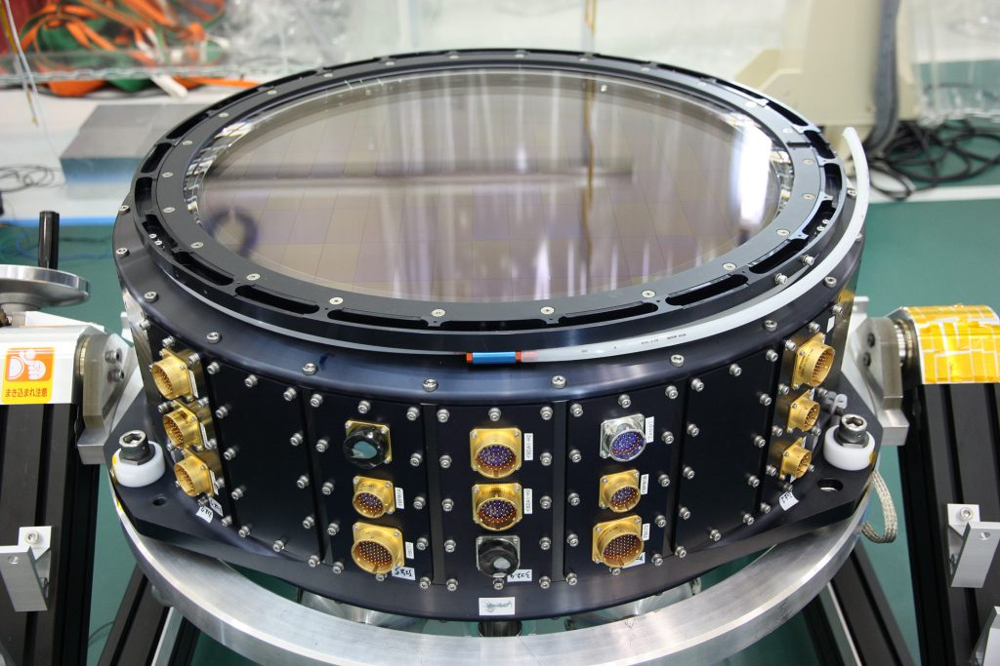
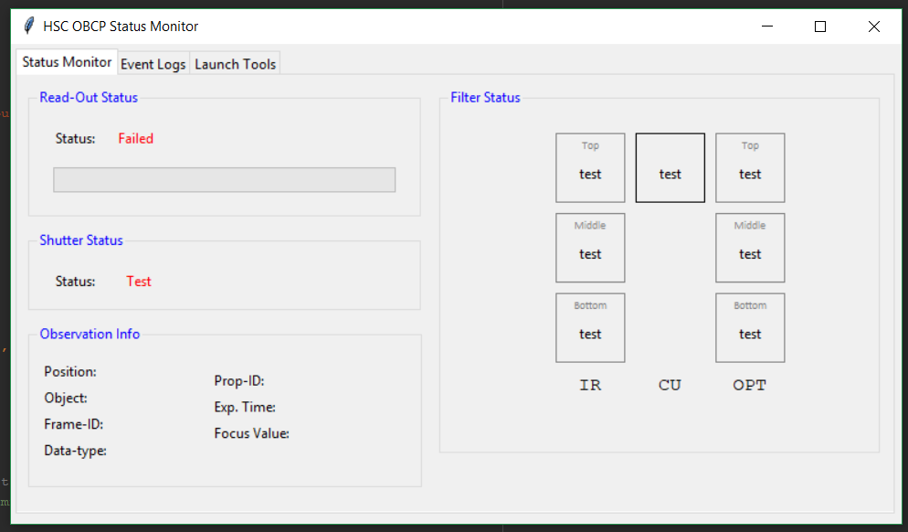
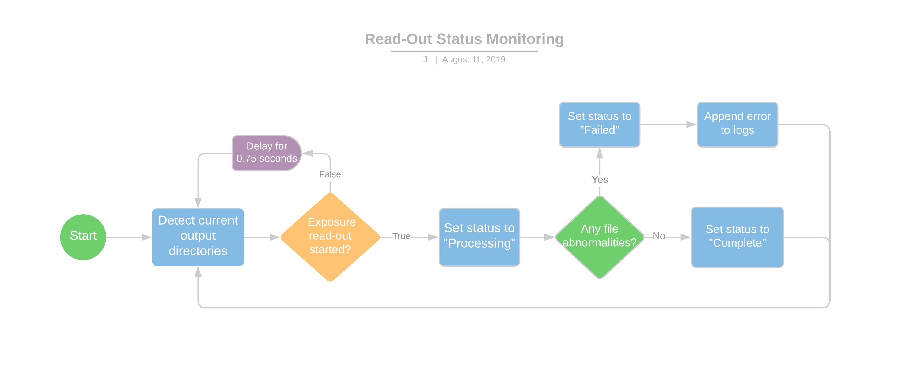

The Hyper-Suprime Cam (HSC) is a large mosaic CCD imager instrument for the Subaru Telescope. It's one of the main instruments for the organization because it's so actively used—it takes up roughly 40% of Subaru’s observation time—and it yields very significant scientific results. However, operating and monitoring the instrument during observation are difficult tasks for astronomers because of its command-line interface (CLI) and the need for manual inspection.

As a software engineering intern for the organization, I worked under the Instruments division to develop an integrated status monitor for the Hyper-Suprime Cam. Using Python, I created a graphical user-interface (above) with Tkinter to replace the system's CLI. I chose Tkinter to minimalize third-party imports. The software also provides centralized status monitoring functionality by integrating all the necessary information and pre-existing tools in one program. This feature automates the process of monitoring the shutter position, filter exchange unit, and read-out status for the astronomers.

Here is the flowchart that illustrates the procedure for monitoring the data read-out during observation:

