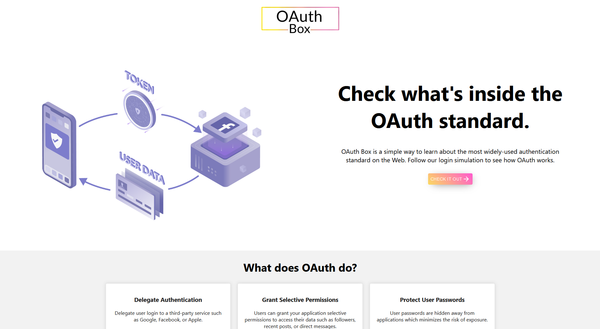

## Introduction
OAuth Box is a web application that demonstrates and describes the OAuth 2.0 standard/framework for authorization delegation. As the web's primary standard for delegating access to protected resources, OAuth 2.0 is widely adapted across the web. 

I created OAuth Box as a learning project to understand OAuth 2.0 and how to implement it from scratch. This gave me the opportunity to dive deeper into web security and research topics such as authentication and token management. 

## OAuth 2.0 and Authorization Code Flow
OAuth Box provides a login simulation that delegates authentication to a "third-party" service and authorizes the app to access the user's "protected" data. By using OAuth 2.0's authorization code flow. In this flow, the resource owner (the user logging in) starts by clicking on a"Login with third-party service" button. The client (web app trying to access the user's data for authentication/authorization) sends an authorization request via browser redirect to the "/authorize" endpoint of the authorization server (third-party server). The authorization server will return a login page which allow the client app to obtain limited access (scopes) to the user's data. Once the user authenticates and grants access, an authorization grant is passed from the third-party service to the client app. With this grant, the client app will then request an access token from the "\token" endpoint of the third-party service's authorization server. The grant is exchanged for an access token. Once the client app has the access token, it may access a protected resource from the third-party service's resource server. 

## Development
I developed OAuth Box using the MERN stack to streamline the development process by primarily working with JavaScript, HTML, and CSS for front-end and back-end. To simulate serparate servers (client app and third-party authorization/resource server) for the authorization code flow, OAuth Box was implemented by running two instances of Express. 

## Technologies
Front-end:
- HTML, CSS, JavaScript
- React
- Material-UI

Back-end:
- JavaScript
- Node.js
- Express.js
- MongoDB

Other:
- Git/GitHub

Links:
Pending...

