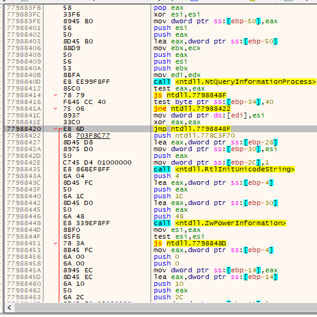
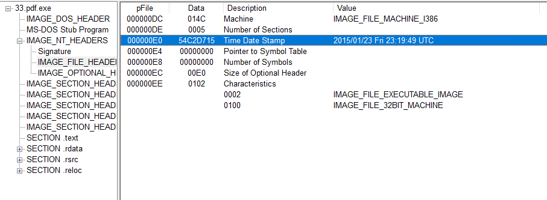

Malware analysis is often performed quickly through services, commercial sandboxes, or quick dynamic analysis to collect IoCs or artifacts to be used in an intrusion detection system. Malware samples, like most complicated software, typically has too many details to individually inspect within a reasonable amount of time in a work environment.

I had picked up the hobby of reverse engineering malware to inspect its details and understand its malicious techniques. Shortly after starting malware analysis, I downloaded a sample of a trojanized Tempedreve variant under the executable file name "33.pdf" (Note: Although it's name implies that it's a PDF, it's actually a portable executable). I used static and dynamic analysis techniques to observe the sample's behavior.

Before running the sample, I used several tools such as PEview, CFF Explorer, BinText, and PEiD to perform basic static analysis on the file in a Windows 10 virtual machine. I managed to discover information such as the executable's creation date (January 23, 2015), its obfuscation techniques such as packing the file's .rsrc and .text sections, function imports (limited imports since it was packed), and its use of API calls for anti-debugging. I also managed to detect that it would spawn several other processes and query the Windows Registry for key values. From the basic static analysis, I collected several indicators to watch for during dynamic analysis.

Here is a picture of the time date stamp in the PE file header:

I performed basic dynamic analysis by simply running the executable while monitoring Windows Registry changes and process activity. I observed that attempting to open "33.pdf" will create a temporary PDF file in the %AppData% folder with the name format "~\[RANDOM ALPHANUMERICS].tmp.pdf". The PDF will be of this document:

<image src="../images/pdf.png">
 
However, I managed to see that there was a lot more going on in the background than a simple PDF document. In conjunction with advanced dynamic analysis with x64dbg, I saw that it would actually drop several files in the AppData\Roaming folder and create two new processes labeled "dosknet.exe" and "bitsepad.exe". Next, the malware would change several Registry values for persistence, check for debugger, read system information (computer name, users, mouse type, keyboard type, language, etc.), inject into several remote processes using application shimming, attempt a heap spray, and edit PDF registry values.

This was one of my first times analyzing malware. I learned a lot about the complicatios of the process, the pros and cons of the various tools, Windows registry, and several malicious techniques. 

