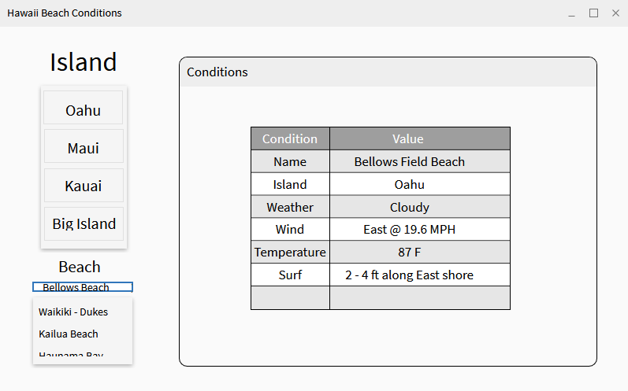

Have you ever thought about going to the beach, but you weren't sure if the conditions were right?

During my free time, I developed a small program called <em>Hawaii Beach Conditions</em>. The program simply allows the user to select various beaches on Oahu, Maui, Kauai, and the Big Island to see its current conditions. The user may select any of the provided islands, choose a beach, then a table will be shown displaying information about the beach.

Some of the information include the beach's name, island, weather, wind , temperature, and surf.

The program was developed in Python 3. The code uses the Hawaii Beach Safety API which returns a JSON containing data on every major beach in Oahu, Maui, Kauai, and the Big Island. The other Hawaiian islands are not options because they are not included in the data returned by the API. Some features planned that I have planned for future development includes a graph that displays the wave height, replacing the table with a nicer design, in-depth weather forecast for the entire day, and images of each beach.

The code will be available through GitHub soon.
