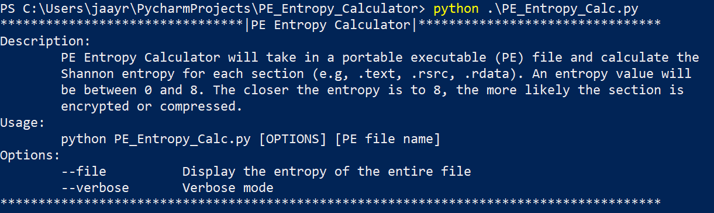
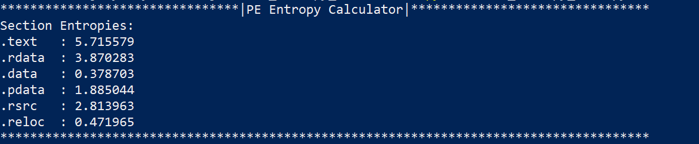

I developed a simple command-line tool to help analyze malware and other programs by calculating the Shannon entropy of each individual section of the portable executable (PE) format. By calculating the entropy, the analyzer can hopefully determine whether the malware sample is packed by encrypting data within one or more of the sections.

The purpose of the PE Section Entropy Calculator is to assist with analyzing malware samples. A common technique that malware authors use to avoid analysis is to obfuscate the code by packing the malware's functionality in one or more sections of the malware's binary. The code is encrypted, compressed, or obfuscated in such a way to avoid static analysis. The code is then placed in one or more sections, and a routine for unpacking the code will be placed in the .text section to unpack the code only at run-time. The presence of encrypted or compressed data can be analyzed using statistics. In this case, the tool uses the Shannon entropy of each section to help determine whether a section may be encrypted or compressed.

The tool was developed in Python 3, and it uses the <em>pefile</em> third-party module to parse the format of a given PE file. It performs a simple check for the PE format by detecting the 0x4D 0x5A (MZ) signature that every PE file begins with. If it passes, then it will continue to read the raw bytes of each section (e.g., .text, .data, .rsrc, ...) and calculates each individual section's Shannon entropy. The results will be printed to the command-line in the format:

The tool also has a couple options such as a verbose mode and an option to calculate the entire file's entropy in addition to the section entropies. These options can be viewed in the description by running the script with no arguments. There are several other features that I plan to implement such as a more thorough routine for checking the file's PE format validity. Another major feature that I have planned is the ability to display more information extracted from the PE format such as the date stamp and the import directory.

Even though this was a small personal project, I learned a lot about handling binaries--specifically those that are in the portable executable format. I got a lot of insight into the PE format which is essential to the way Windows handles executable programs. This project allowed me to dive deep into the format and learn about the different components of .exe or .dll files. I also gained more experience with creating my own tools for malware analysis. As a result of creating this project, I was exposed to the practice of quickly writing my own software tools to automate specific jobs and assist with larger tasks and projects. This experience will contribute towards my professional career

Link to GitHub repository is pending.

