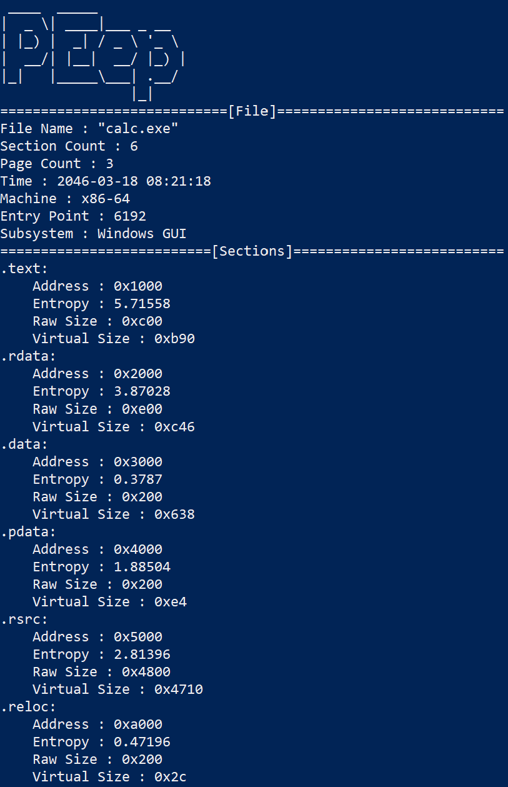

<hr>
# Note: As of 11/12/19, this project is currently being overhauled, so this page is a work-in-progress and is subject to a lot of change
Originally, I developed a simple command-line tool to help analyze malware and other programs by calculating the entropy of each individual section of the portable executable (PE). By calculating the entropy, the analyzer could hopefully determine whether the malware sample is packed by encrypting data within one or more of the sections. However, I have since expanded the functionality of the program, and I'm currently working on turning the script into a general analysis tool. A link to the GitHub repository can be located at the bottom of the page.

The purpose of the PEep is to assist with analyzing malware samples. A common technique that malware authors use to avoid analysis is to obfuscate the code by packing the malware's functionality in one or more sections of the malware's binary. The code is encrypted, compressed, or obfuscated in such a way to avoid static analysis. The code is then placed in one or more sections, and a routine for unpacking the code will be placed in the .text section to unpack the code only at run-time. The presence of encrypted or compressed data can be analyzed using statistics. In this case, the tool uses the Shannon entropy of each section to help determine whether a section may be encrypted or compressed.


The tool was developed in Python 3, and it uses the <em>pefile</em> third-party module to parse the format of a given PE file. It performs a simple check for the PE format by detecting the 0x4D 0x5A (MZ) signature that every PE file begins with. The simple check is implemented with:
```
if file.DOS_HEADER.dump_dict().get('e_magic').get('Value') != 23117:
```

If it passes, then it will continue to collect information from the PE format including the machine type, subsystem, raw and virtual sizes, time-date stamp, and other information. Afterwards, it will continue to read the raw bytes of each section (e.g., .text, .data, .rsrc, ...) and calculates each individual section's entropy. The results will be printed to the command-line in the format:



The tool also has a couple options such as a verbose mode and an option to target a specific section to analyze. Also, it will implement the ability to hex dump a specific section out to the terminal or a specified text file.

Even though this was a small personal project, I learned a lot about handling binaries--specifically those that are in the portable executable format. I got a lot of insight into the PE format which is essential to the way Windows handles executable programs. This project allowed me to dive deep into the format and learn about the different components of .exe or .dll files. I also gained more experience with creating my own tools for malware analysis. As a result of creating this project, I was exposed to the practice of quickly writing my own software tools to automate specific jobs and assist with larger tasks and projects.

[Link to GitHub repository](https://github.com/jayryanj/PEep)


