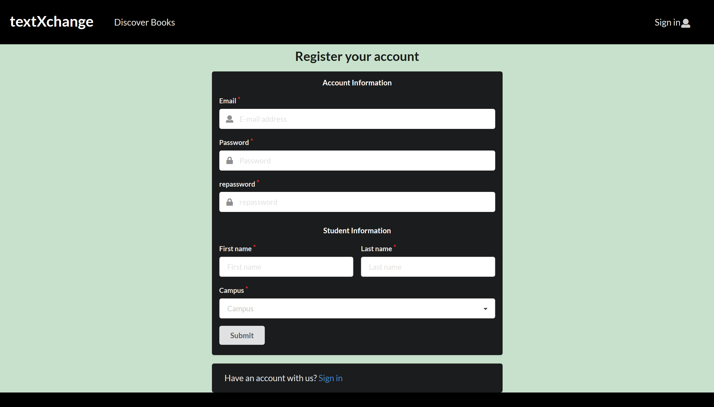
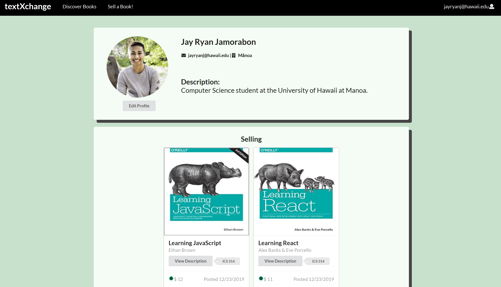
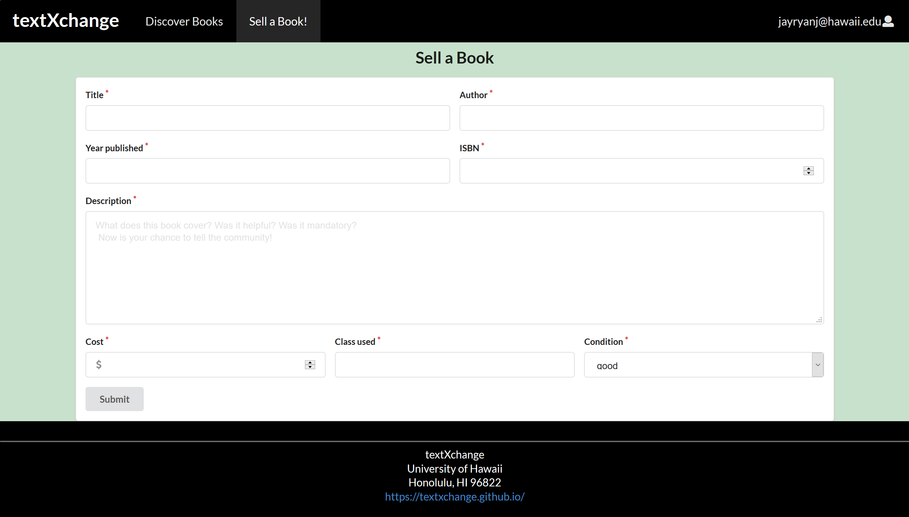

TextXchange is a textbook-exchange web application that enables students at the University of Hawaii to easily sell and purchase textbooks for their classes. Students can save and earn more money without having to go to the bookstore. The project was developed by a team of computer science students including myself. The project's homepage can be found [here](https://textxchange.github.io/) which includes information regarding the textXchange development team and thorough documentation about installation and use. The deployed version could also be accessed [here](textxchange.meteorapp.com).

The project was developed using React and Semantic-UI frameworks for front-end and Meteor for back-end. User data is stored using MongoDB.
 

TextXchange's interface is simple and easy to navigate. To demo the application, you must register an account which can be found in the "Log In" page at the top-right. The user must provide an email, password, name, and a University of Hawaii campus. 

The application will then route to a profile page which may display information such as the user's email, name, description, campus, and books that they may be selling.

The "Discover Books" page allows users to search for books based on title, author, and class that it may be used in. It will then display the unionized results of all the criteria added to the search. It will display a grid of books in the database that matches. The user may offer to purchase the book from the seller which will notify the seller through an email notification. 

The user may also sell a book which requires information such as the title, author, publishing year, description, and ISBN. The application will use an API to assign a textbook cover image to the entry by looking up the ISBN for the user. Upon submission, the book can be found on the user's profile and the discover page. 

This project was a part of my ICS 314 class which requires building a full-stack web application within a team. We used Github to manage coding collaboration and planning. Further details about the project can be accessed through the project's [homepage](https://textxchange.github.io/). The source code for the project could also be accessed using the previous link. 

