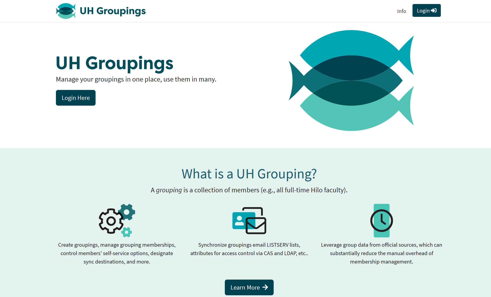

UH Groupings is an open-source web application developed by my team, the Identity and Access Management (IAM) Web Development Team, that allows users to create and manage "Groupings" which are collections of members (e.g. all full-time faculty). Groupings can be integrated with one or more of the following: email LISTSERV lists, permissions and privilege assignments for access control via CAS, etc. Additionally, UH Groupings allows users to leverage existing membership collections, which can substantially reduce the manual overhead of membership management. Links to the GitHub repositories can the deployed site can be found at the bottom of the page.

As a member of of the IAM Web Development Team, I've primarily focused on the web application's back-end codebase. My contributions include writing Java code for the application's API endpoints and services which interfaces with an instance of Internet2's Grouper application. In addition, some of my work goes towards the project's unit and integration test code. 

From this project, I gained a lot of real-world experience working in an Agile software development team using Git and Jira Kanban board. I've also learned a lot about the ins and outs of the Java Spring framework and API design. 

Links:
- [UH Groupings API - GitHub Repository](https://github.com/uhawaii-system-its-ti-iam/uh-groupings-api)
- [UH Groupings UI - GitHub Repository](https://github.com/uhawaii-system-its-ti-iam/uh-groupings-ui)
- [Deployed Site](https://www.hawaii.edu/its/uhgroupings/)

