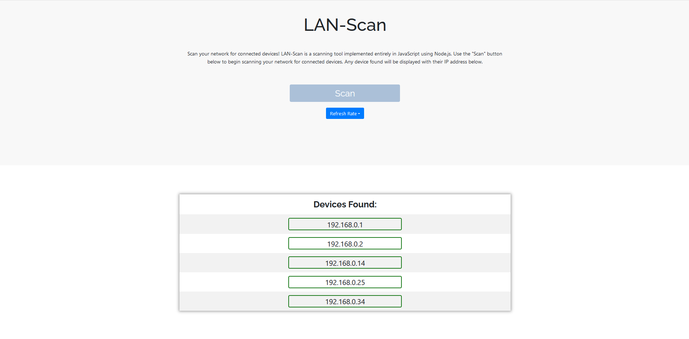

LAN-Scan-js is a web browser tool that allows users to run a basic host-discovery scan against their LAN. 

This is a simple tool to provide users the ability to ping scan their local network for connected devices. It avoids the need to write your own script in the command-line or use a more complex tool such as nmap. It uses ICMP Echo to contact devices, and it works on Windows and Linux platforms. One of the main purposes of LAN-Scan-js is to implement its main scanning functionality entirely in JavaScript. However, this isn't possible to do entirely in the browser without leveraging some security attacks. Thus, the main scanning function was implemented in the back-end using Node.js for its runtime environment. The front-end was developed using React-Bootstrap. This project is meant to be run locally, so there is no deployed site. DO NOT use this on the public Internet.

Below, you can see the technologies used in the development of LAN-Scan-js

Front-end:
- HTML, CSS, JavaScript
- React
- Bootstrap

Back-end:
- JavaScript
- Node.js
- Express.js

Other:
- Git/GitHub

A link to the Github repo is provided below.

Links:
- [URLookup Github Repo](https://github.com/jayryanj/lan-scan-js)

